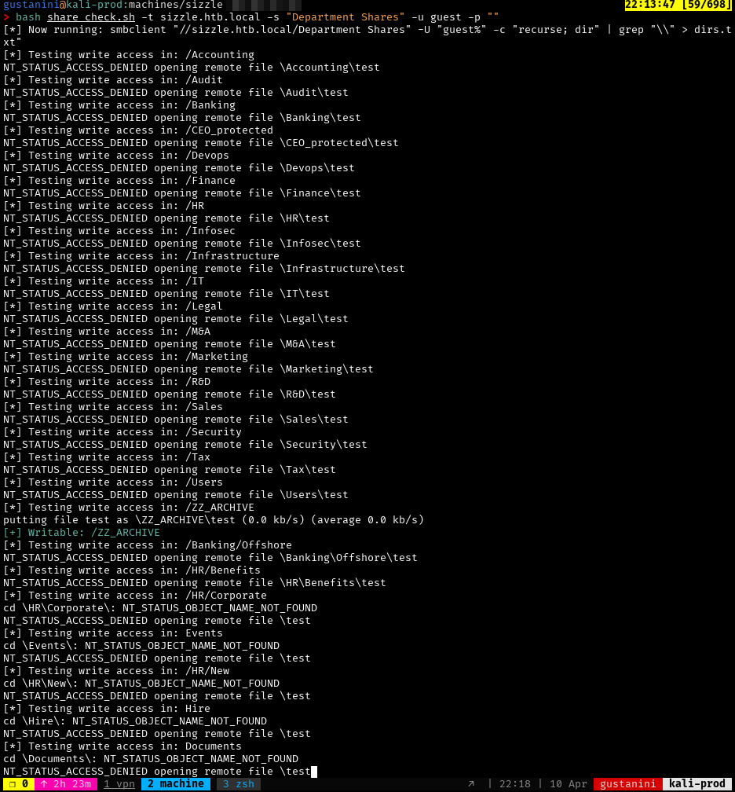

# SMB Write Checker

Bash script to recursively check for writable directories within an SMB share by attempting to upload a test file to each directory found. Writable directories are highlighted in green for easy identification.

## Features
- Recursively lists directories in an SMB share.
- Attempts to upload a test file to check for write access.
- Highlights writable directories in green for easy visibility.

## Requirements
- `smbclient` from the Samba suite.

## Installation

1. Clone this repository:

   ```bash
   git clone https://github.com/yourusername/smb_write_checker.git
   cd smb_write_checker
   ```

2. Ensure `smbclient` is installed on your system:

   - On Ubuntu/Debian:

     ```bash
     sudo apt install smbclient
     ```

   - On CentOS/RHEL:

     ```bash
     sudo yum install samba-client
     ```

3. Make the script executable:

   ```bash
   chmod +x smb_write_checker.sh
   ```

## Usage

Run the script with the following arguments:

```bash
./smb_write_checker.sh -t <target> -s <share> -u <username> -p <password>
```

### Arguments

- `-t`  **Target**: The SMB server address (e.g., `sizzle.htb.local`).
- `-s`  **Share**: The name of the SMB share to scan (e.g., `Department Shares`).
- `-u`  **Username**: The username for SMB authentication.
- `-p`  **Password**: The password for the provided username (can be empty if no password is required).

### Example

```bash
./smb_write_checker.sh -t sizzle.htb.local -s "Department Shares" -u guest -p ""
```

## Output

- The script will print a list of directories being tested.
- Writable directories will be highlighted in green with the message:

  ```
  [+] Writable: /path/to/directory
  ```



## License

This project is licensed under the MIT License - see the [LICENSE](LICENSE) file for details.

## Disclaimer

This tool is intended for educational purposes only. Ensure you have permission to test any SMB shares you are scanning.
